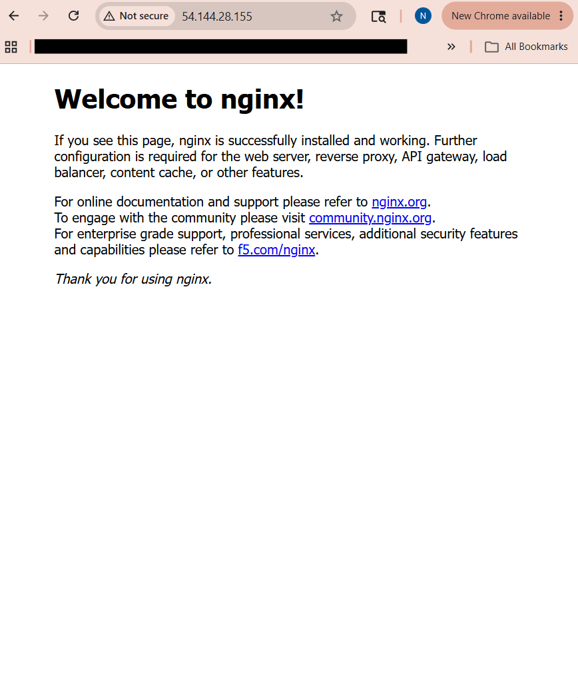

# Terraform AWS Nginx Lab

This lab deploys an AWS EC2 instance using Terraform, attaches a security group, connects using SSH, installs Nginx, and verifies the web server from a browser.

## Tools Used

* AWS
* Terraform
* GitHub
* Git Bash
* Amazon Linux 2
* Nginx

## What This Lab Builds

* EC2 instance
* Security group
* SSH access using a key pair
* HTTP access on port 80
* Nginx web server

## Terraform Commands Used

```bash
terraform init
terraform validate
terraform plan
terraform apply
```

## Result

Nginx was successfully installed and accessed from the EC2 public IP address.



## Cleanup

To destroy the AWS resources:

```bash
terraform destroy
```

